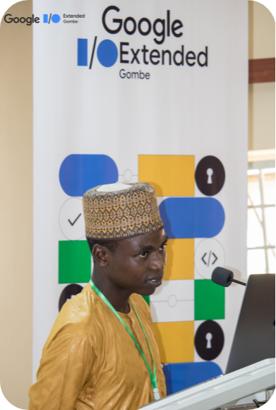

### 🎓 Course Highlights 
*Unlock the Power of Python! 🚀*

### 🔍 Curriculum Overview
 
*From Basics to Brilliance*

  
Module 1: **Introduction to Programming and Python**

  
- Overview of programming concepts
- Why Python is a great choice for beginners
- Brief history of Python and its creator, Guido van Rossum
- Introduction to Python's philosophy: The Zen of Python
- Setting up Python environment
  

Module 2: **Python Basics and Mindset Tips**

- Basics of using the Python interpreter
- Printing text and variables using `print`
- Importance of indentation in Python
- Comments and their role in code readability
- Tips for cultivating a programmer's mindset

Module 3: **Control Flow in Python**

- Understanding conditional statements (if, else)
- Utilizing loops (while and for)
- Break and continue statements
- Using else clauses with loops
- The pass statement and its applications

Module 4: **Functions and Scope**

- Introduction to functions and their role in modular programming
- Scope of variables and their visibility
- Importing functions from other files
- Creating modules and organizing code
- Utilizing the built-in function `dir()`

Module 5: **Data Structures in Python**

- Understanding and using lists
- Differences between strings and lists
- Common list methods and their applications
- Working with sets and dictionaries
- Overview of tuples and their use cases

Module 6: **Exception Handling**

- Distinguishing errors from exceptions
- Introduction to exceptions and their importance
- Handling exceptions gracefully
- Purpose of catching exceptions
- Raising built-in exceptions

Module 7: **Object-Oriented Programming (OOP) Basics**

- Introduction to OOP concepts
- Defining classes and objects
- Attributes and methods in classes
- The special `__init__` method and its significance
- Understanding Data Abstraction, Data Encapsulation, and Information Hiding

Module 8: **Advanced OOP Concepts**

- Working with properties in classes
- Difference between attributes and properties
- Pythonic way to write getters and setters
- Special methods `__str__` and `__repr__`
- Class attributes, class methods, and static methods

Module 9: **Dynamic Attribute Handling**

- Dynamically creating new attributes for existing instances
- Binding attributes to objects and classes
- Exploring `__dict__` of a class and an instance
- How Python finds attributes of an object or class
- Using the `getattr` function

Module 10: **Advanced Topics**

- Understanding tracebacks
- Utilizing the `range` function
- Exploring arithmetic operators in Python
- Advanced concepts in Python programming

Module 11: **Career Guidance and Opportunities**

- Overview of Python's significance in the industry
- Exploring various career paths with Python
- Developing a portfolio and personal projects
- Importance of networking and community involvement

Module 12: **Resources and Continuous Learning**

- Curated resources for continuous learning
- Online communities and forums
- Further educational opportunities and certifications
- Staying updated with the latest Python developments
- Guidance on pursuing a career in Python and related fields

:::tip[ 👩‍💻 Hands-On Projects Bring Your Ideas to Life!]
Apply your knowledge through exciting projects, ranging from building a Desktop application to automating everyday tasks. Receive personalized feedback from our experienced instructor, ensuring you gain practical skills that set you apart in the competitive tech landscape.
::: 

### 👨‍🏫 Expert Instructor 

[Meet your mentor](https://github.com/AdamsGeeky), a prominent figure in the [open-source community](https://www.linkedin.com/company/opls/), a [Google Developers student Club Chapter Lead](https://gdsc.community.dev/gombe-state-university/), and an [ALX Software Engineering student](https://www.alxafrica.com/software-engineering-hard-vs-soft-skills/). Benefit from real-world insights, industry best practices, and guidance from someone actively shaping the future of technology.

### 🖥️ State-of-the-Art Lab Innovation Starts Here!

Immerse yourself in a cutting-edge learning environment with top-tier computers and resources. From collaborative coding sessions to experimenting with the latest tools, our lab provides the perfect space for your programming journey.

::::::tip[Join the Tech Revolution Secure Your Future Today!]

:::warning[🚨 Limited Seats ]
[Enroll now](https://chat.whatsapp.com/DswdOmcTabcEuwSfdJyp3R)
::: 
to guarantee your spot in this transformative Python Programming Course. Seize the opportunity to be mentored by a leader in the industry, and elevate your skills to meet the demands of the ever-evolving tech landscape.
::::::

::::::warning[🚨 Limited Seats Available Act Now!]
Don't miss your chance to be part of this exclusive learning experience. Limited seats are available in our state-of-the-art lab. 

:::tip[🚨 Limited Seats ]
[Enroll today](https://chat.whatsapp.com/DswdOmcTabcEuwSfdJyp3R)
::: 

Step confidently into the future of programming! Your journey to digital mastery begins here. 🌟

::::::

