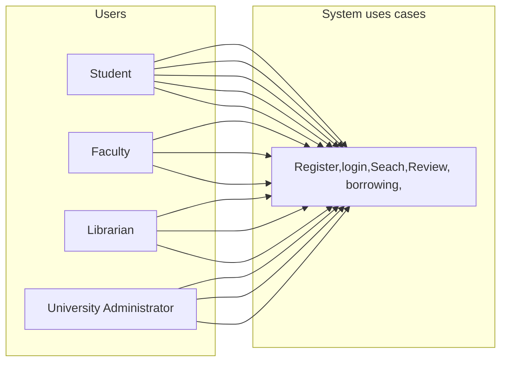
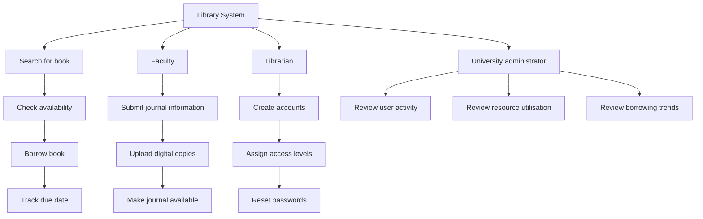
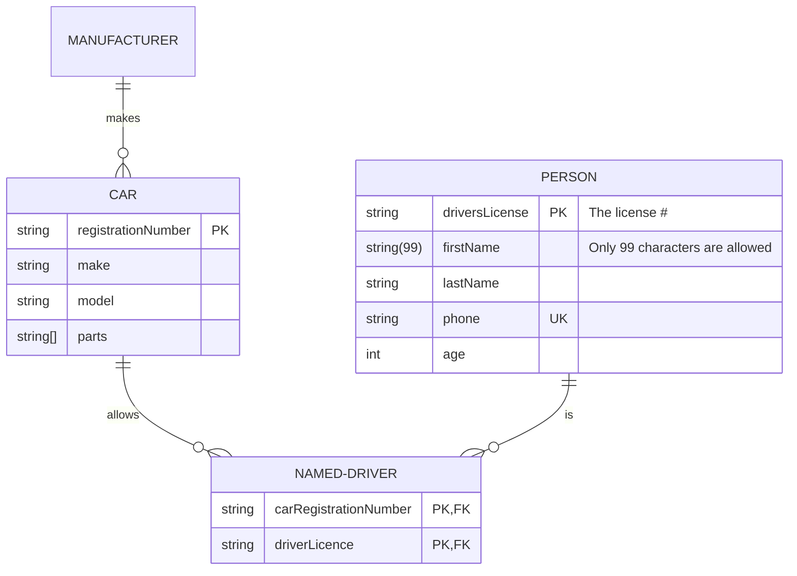

# Array 

```mermaid
graph LR
  subgraph Users
    A[Student]
    B[Faculty]
    C[Librarian]
    D[University Administrator]
  end
  subgraph System uses cases
    E[Library System]
  end
  A --> E[Search for book]
  A --> E[Check availability]
  A --> E[Place hold]
  A --> E[Borrow book]
  A --> E[Track due date]
  B --> E[Submit journal info]
  B --> E[Upload digital copies]
  B --> E[Make available]
  C --> E[Create account]
  C --> E[Assign access level]
  C --> E[Reset password]
  D --> E[Review user activity]
  D --> E[Review resource utilization]
  D --> E[Register,login,Seach,Review, borrowing,]
```

```mermaid
graph TD
A[Library System] --> B[Search for book] --> C[Check availability]
C --> E[Borrow book]
E --> F[Track due date]
A --> G[Faculty]
G --> H[Submit journal information]
H --> I[Upload digital copies]
I --> J[Make journal available]
A --> K[Librarian]
K --> L[Create accounts]
L --> M[Assign access levels]
M --> N[Reset passwords]
A --> O[University administrator]
O --> P[Review user activity]
O --> Q[Review resource utilisation]
O --> R[Review borrowing trends]
```

```mermaid
erDiagram
    CAR ||--o{ NAMED-DRIVER : allows
    CAR {
        string registrationNumber PK
        string make
        string model
        string[] parts
    }
    PERSON ||--o{ NAMED-DRIVER : is
    PERSON {
        string driversLicense PK "The license #"
        string(99) firstName "Only 99 characters are allowed"
        string lastName
        string phone UK
        int age
    }
    NAMED-DRIVER {
        string carRegistrationNumber PK, FK
        string driverLicence PK, FK
    }
    MANUFACTURER only one to zero or more CAR : makes
```